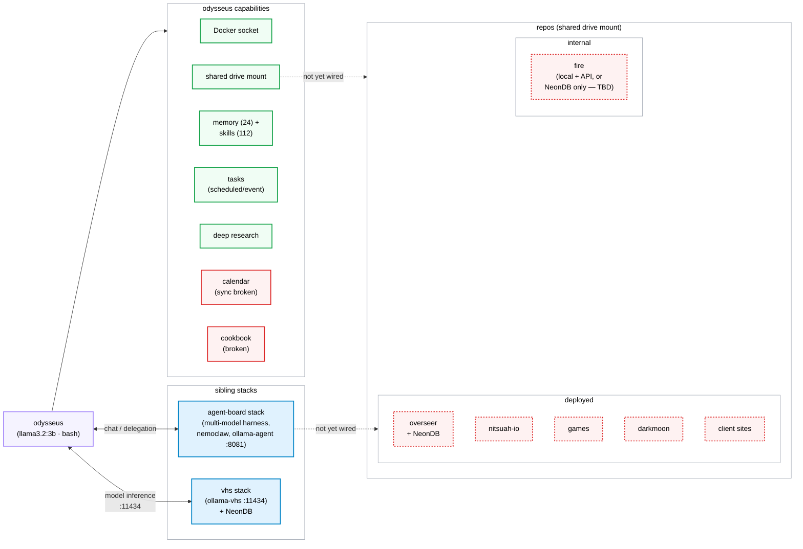

# Odysseus Ecosystem — Current State Diagram

repo: [odysseus]

Simplified view: odysseus's actual capabilities, its sibling stacks, and the
repos accessible via the shared drive mount (split into deployed vs internal).

Green = working today. Red solid = exists but broken. Red dashed = not wired
up / doesn't exist yet.

odysseus_ecosystem_diagram