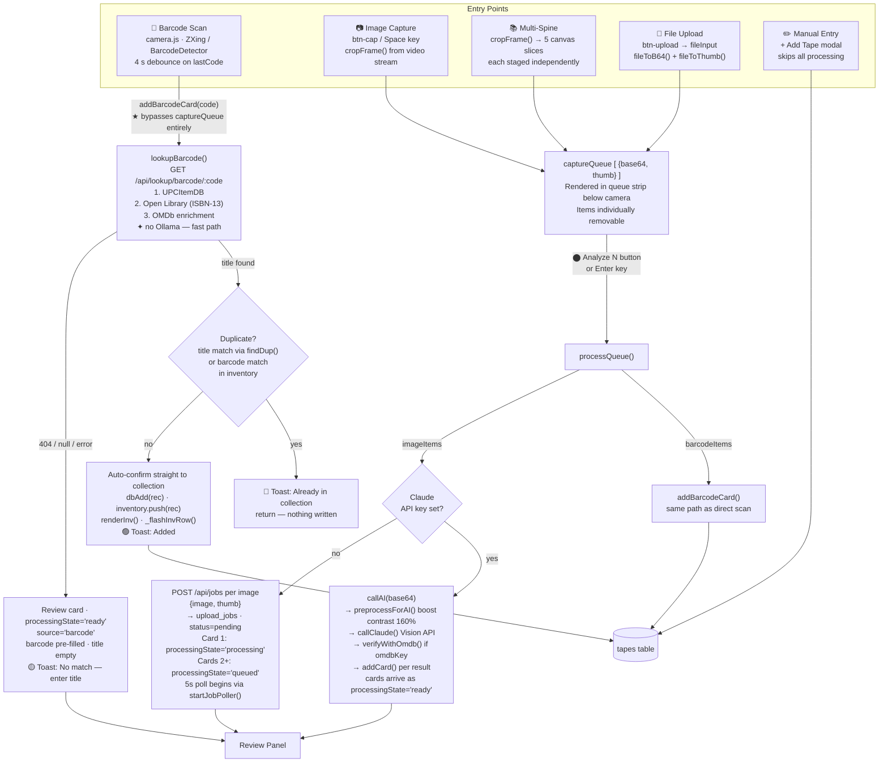
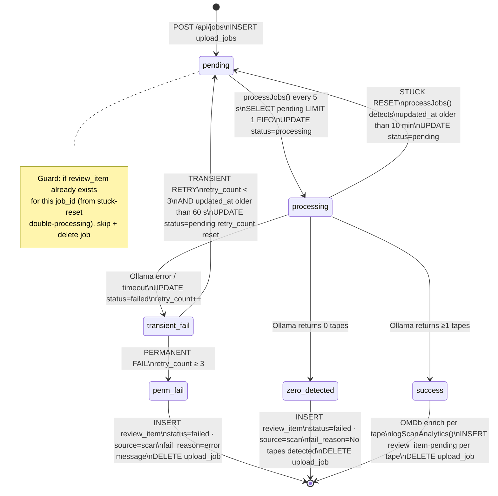
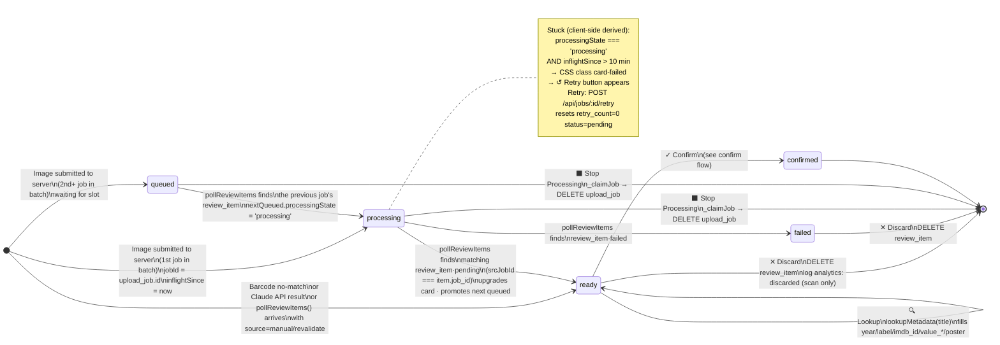
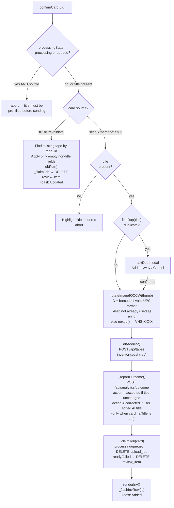
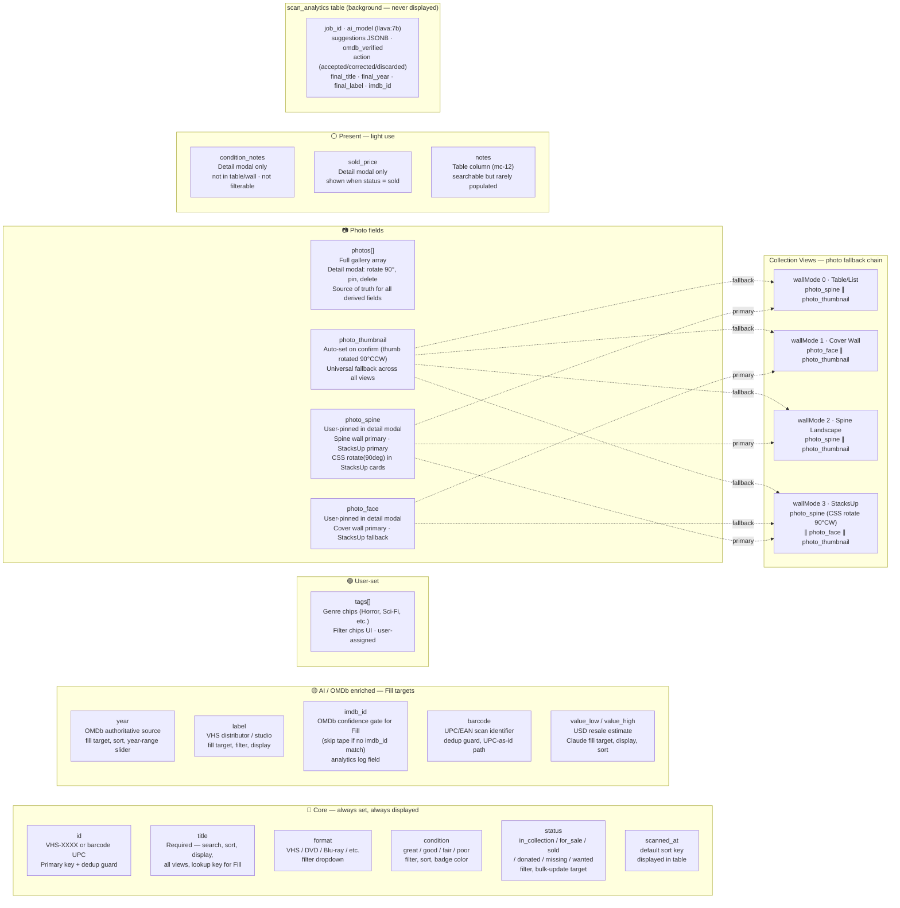

# VHS Scanner — System Flow Diagrams

## Diagram 1 — Capture Types & Staging States

---

## Diagram 2 — Server Job Lifecycle (upload_jobs state machine)

---

## Diagram 3 — Review Card Lifecycle

### Confirm routing

---

## Diagram 4 — Collection Metadata Fields

