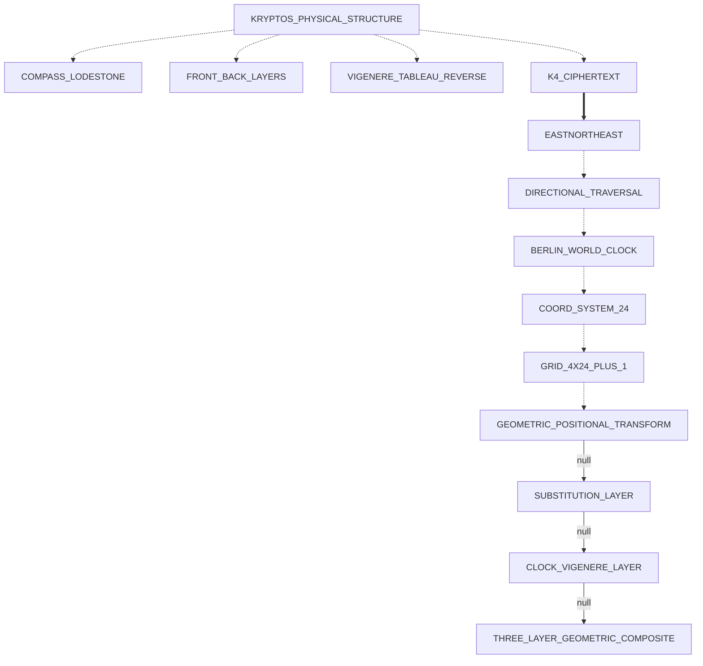

# K4 Active Research State

> 🧭 [kryptos](../../README.md) · [Index](../INDEX.md) · [Features](../FEATURES.md) · [Roadmap](../ROADMAP.md) · [Tasks](../TASKS.md) · [Changelog](../CHANGELOG.md) · [Metrics](../METRICS.md) <!-- nav -->

**Last Updated:** 2026-09-03
**Status:** Living document — update after each meaningful run or finding

This document tracks what is currently known, what has been tested and ruled out, and the active attack queue for K4 cryptanalysis.

---

## Confirmed Facts (High Confidence)

| Fact | Evidence | Source |
|------|----------|--------|
| K4 is 97 chars: `OBKRUOXOGHULBSOLIFBBWFLRVQQPRNGKSSOTWTQSJQSSEKZZWATJKLUDIAWINFBNYPVTTMZFPKWGDKZXTJCDIGKUHUAUEKCAR` | Sculpture transcription | Community |
| Plaintext at 0-indexed 21–24 = EAST | Sanborn confirmed | 2023 |
| Plaintext at 0-indexed 25–33 = NORTHEAST | Sanborn confirmed | 2020 |
| Plaintext contains BERLIN | Sanborn confirmed | 2010 |
| Plaintext contains CLOCK (follows BERLIN) | Sanborn confirmed | 2014 |
| BERLIN ciphertext = NYPVTT at 0-indexed 63–68 | Deduced from community position | Community |
| CLOCK ciphertext = MZFPK at 0-indexed 69–73 | Deduced from community position | Community |
| Sanborn used "five or six techniques" | Direct quote | Wired, 2005 |
| Deliberate misspellings likely in K4 (pattern from K1, K3) | IQLUSION, DESPARATLY | K1/K3 solved |
| K4 IC ≈ 0.062 (near-English, not random) | Computed | Internal |
| Local IC non-uniform across segments | Computed | Internal |

---

## Ruled Out (Confirmed Negative Results)

| Hypothesis | Status | Evidence |
|------------|--------|----------|
| Single-layer repeating Vigenère with any key | RULED OUT | HRDXDBAUZGSAV as repeating key does not produce English outside crib window |
| Direct Berlin Clock single-layer Vigenère | RULED OUT | All 720 clock states tested (`run_composite_sweep`). Shifts include 17, 20, 25 which no clock row can produce alone. |
| Transposition-first composite | DISFAVORED, not proven | Non-uniform local IC is *more consistent with* substitution-then-transposition order under the models tested here than the reverse — suggestive, not an independent proof of operation order. (2026-09-03: softened from "RULED OUT" — see below.) |
| Simple Caesar or monoalphabetic substitution | RULED OUT — corrected reasoning, 2026-09-03 | This row previously read "IC ≈ 0.062 rules out single-alphabet substitution" — that overstated what IC proves. A monoalphabetic substitution is a 1:1 relabeling and therefore *preserves* the plaintext's own index of coincidence by construction; English prose runs ≈0.065–0.067, so K4's ≈0.062 is close to that range and does not by itself distinguish monoalphabetic substitution from plaintext-like structure. The real proof is a direct, code-verified one: of the 24 confirmed plaintext characters (the four cribs), 9 letters (A, C, E, L, N, O, R, S, T) each recur, and 8 of the 9 map to a *different* ciphertext letter at each occurrence — e.g. plaintext `E` → `F` at position 21, → `G` at position 30, → `Y` at position 64. A fixed monoalphabetic substitution requires every occurrence of the same plaintext letter to map to the same ciphertext letter; this data contradicts that on 8 independent letters simultaneously, which coincidence alone cannot explain. Ruled out on that basis, not on IC. |
| K1/K2 keys (PALIMPSEST, ABSCISSA) as direct Vigenère keys for K4 | RULED OUT | Confirmed by community + pipeline results |
| Keyed alphabet (KRYPTOS/PALIMPSEST/ABSCISSA) realignment → structured keystream | RULED OUT | `check_keyed_alphabet_realignment` tested all three alphabets; keystream at EAST+NORTHEAST positions does not resolve to a recognizable pattern under any of them |
| Full composite sweep: 3 alphabets × 3 grid sizes × 720 clock states × ENE+columnar routes | NULL RESULT | `run_composite_sweep` completed; no simultaneous 4-crib match. Null artifact: `K4_COMPOSITE_SWEEP_NULL.json`. Best candidates had ≤1 keyword hit. |
| ENE diagonal route transposition (67.5°) with clock-Vigenère | NULL RESULT | `read_ene_diagonal` integrated into full sweep; all route variants tested. No breakthrough. |
| ADFGVX (Polybius + columnar transposition) | NULL RESULT | Implemented (`kryptos.k4.adfgvx`) and tested against K4; no crib match |
| Nihilist (Polybius + numeric key) | NULL RESULT | Implemented (`kryptos.k4.nihilist`) and tested against K4; no crib match |
| Pure (single-layer) Quagmire I–IV | NULL RESULT | `run_quagmire_sweep` — 6,240 combinations: Q1/Q2/Q3 × 4 alphabet keywords × 10 word keys × 2 indicator bases, Q4 ordered keyword pairs, plus Q3 × 1,440 Berlin Clock minute-state indicator keys on the KRYPTOS tableau. Zero positional crib or keyword hits. Artifact: `K4_QUAGMIRE_NULL.json`. Reinforces the substitution+transposition composite model — implementation verified by exactly reproducing K1/K2 (Quagmire III, KRYPTOS tableau). |
| Physical-grid (copper-screen tableau) keystreams | NULL RESULT | `run_physical_grid_attack` — walks the 26×26 KRYPTOS Vigenère tableau along 108 geometric routes (26 rows, 26 columns, 26 main/26 anti diagonals, 4 serpentine reads) × 2 indicator bases = 216 candidates via Quagmire III. Zero positional crib hits. Artifact: `K4_PHYSICAL_GRID_NULL.json`. Tests the "physical keystream read off the sculpture" theory. (Note: on the cyclic tableau the diagonals are degenerate — anti-diagonals are constant letters, main diagonals 13-letter cycles — so rows/columns/serpentine are the substantive routes.) |
| Combined 24-column geometric permutation + physical tableau (Physical/Geometric Pivot) | NULL RESULT | `run_geometry_combined_sweep` — 20 fill-orders/routes (16 `geometry24` orders incl. reversed + 4 ENE/NE route families) × 4 shape-preserving reflections × {0,+6,-6} Berlin/Langley rotation offsets × 3 remainder modes (trailing/leading/drop for the 97th char) × 108 `physical_grid` tableau routes × 2 indicator bases = **155,520 candidates**, ~7s. **Zero candidates matched even one positional crib** (`best_candidates` empty). Artifact: `K4_GEOMETRY_COMBINED_NULL.json`. This is the permutation front-end `physical_grid.py` lacked — see [Physical/Geometric Pivot](#physicalgeometric-pivot-2026-08-29) below. |
| Combined geometric permutation with geography-derived rotation offsets | NULL RESULT | Same sweep as above with `rotation_offsets` replaced by 6 geography-derived values (CIA→Berlin bearing mod 24, K2-coordinate-derived hours, magnetic declination) — **311,040 candidates**, ~14s. Zero positional crib hits (one incidental substring-only "EAST" keyword hit, not positionally correct). Artifact: `K4_GEOMETRY_COMBINED_GEO_NULL.json`. |
| Combined geometric permutation using the exact CIA→Berlin bearing as a route direction (item 12) | NULL RESULT | `order_names=GEO_BEARING_ORDER_NAMES` — the real ~44.4° great-circle bearing (not snapped to a named 16-point compass direction) and its 180°-reversed counterpart, traced via `ene_routes.trace_route`'s float-bearing support, × 4 reflections × {0,+6,-6} × 3 remainder modes × 108 tableau routes × 2 bases = **15,552 candidates**, <1s. Zero positional or keyword hits. Artifact: `K4_GEOMETRY_COMBINED_GEO_BEARING_NULL.json`. |
| Myszkowski transposition (P8) — repeated-letter keyword grouped-column transposition | NULL RESULT | `run_myszkowski_attack` (`kryptos.k4.myszkowski`) — `ABSCISSA` and `PALIMPSEST` (the two Kryptos keys that actually have repeated letters; KRYPTOS doesn't) × decrypt/encrypt direction = **4 candidates**. Zero positional or keyword hits. Artifact: `K4_MYSZKOWSKI_NULL.json`. |
| Trifid cipher (P9) — 27-cell (3×3×3) cube fractionation | NULL RESULT | `run_trifid_attack` (`kryptos.k4.trifid`) — 6 keyword candidates (KRYPTOS, PALIMPSEST, ABSCISSA, and 3 pairwise concatenations) × 13 period lengths (3–97) = **78 candidates**. Zero positional or keyword hits. Artifact: `K4_TRIFID_NULL.json`. |
| Simulated-annealing substitution-key search behind a Phase-1 geometric permutation front-end (item 15, optional) | NULL RESULT | `run_geometry_substitution_sa_sweep` (`kryptos.k4.geometry_substitution_search`) — 8 base `geometry24` fill orders (identity reflection, zero rotation, trailing remainder) × 3 SA restarts (3,000 iterations each, temperature/cooling schedule) = **24 candidates**, ~14s. Zero positional crib hits (one incidental substring-only "BERLIN" keyword hit, not positionally correct). Artifact: `K4_GEOMETRY_SUBSTITUTION_SA_NULL.json`. Fills a genuine gap in the existing heuristic-search infrastructure (`hill_genetic.py` is Hill-3×3-specific, `transposition_analysis.py`'s SA is columnar-permutation-specific): a proper SA search over the general substitution key space, paired with the Phase-1 geometric permutation inversion instead of only the handful of named keyed alphabets every other composite sweep tries. |
| Mengenlehreuhr → Weltzeituhr precise bearing (69.0°/70.8°) as route direction | NULL RESULT | `clock_rotation.mengenlehreuhr_weltzeituhr_bearings()` — real geodesic bearing between the Berlin Clock's current and 1990 (Sanborn-era) locations and the World Clock at Alexanderplatz, both within 1.5–3.3° of exact ENE. Wired into `geometry_combined_sweep.GEO_BEARING_ORDER_NAMES` automatically. **46,656 candidates**, zero positional or keyword hits. Artifact: `K4_GEOMETRY_COMBINED_GEO_BEARING_NULL.json`. |
| November 9 1989 (Berlin Wall fall) as priority clock state | NULL RESULT | `three_layer_composite.BERLIN_WALL_PRIORITY_TIMES` — 3 sourced CET moments (18:53/19:05/20:00) + EST equivalents, via `run_three_layer_composite_geometric`. **17,280 candidates**, zero hits. Artifact: `K4_3LAYER_GEOMETRIC_BERLINWALL_NULL.json`. |
| P2 shadow/null masking, thorough scope (already wired, never previously executed) | NULL RESULT | 8 masking variants × 4 alphabets × 2 grids (7/8 cols) × 2 clock states (00:00/12:00) × 24 perms/grid × 2 routes = **6,144 candidates**. 40 near-misses, all single-keyword coincidences, none positional or simultaneous. Artifacts: `K4_MASK_*_NULL.json` (8 files). |
| P5 BERLIN+CLOCK 2-crib relaxed gate — both brute-force and Phase-1 geometric transposition (already wired, never previously executed) | NULL RESULT | `run_three_layer_composite(keyword_eureka_threshold=2)` (34,560 candidates) and, for the first time, the same relaxed gate against `run_three_layer_composite_geometric` (69,120 candidates, full clock sweep). Zero near-misses either way. Artifacts: `K4_P5_2CRIB_NULL.json`, `K4_P5_GEOMETRIC_2CRIB_NULL.json`. |
| P6 K3 plaintext as running Vigenère key (already wired, never previously executed) | NULL RESULT | 4 variants (standard/KRYPTOS alphabet × direct/reversed key) = **4 candidates**, zero keyword hits. Artifact: `K4_P6_RUNNING_KEY_NULL.json`. |
| `reflection.py` shape-changing transpose family, wired into a sweep (Phase 7) | NULL RESULT | `composed_flat_indices` extended to handle the 4×24→24×4 transpose family correctly (verified bijection + round-trip). 3 runs: default scope (**155,520**), geography-derived offsets (**414,720**), and via `run_three_layer_composite_geometric` (**69,120**). Zero positional or keyword hits any way. Artifacts: `K4_GEOMETRY_COMBINED_SHAPECHANGING_NULL.json`, `K4_GEOMETRY_COMBINED_SHAPECHANGING_GEO_NULL.json`, `K4_3LAYER_GEOMETRIC_SHAPECHANGING_NULL.json`. |
| "Shadow of the word" as a computed shadow angle — World Clock topper rotation (full 0-23 sweep, then a resolved precise-angle sweep) and real solar azimuth at CIA HQ (Phase 7) | NULL RESULT | `kryptos.k4.solar_geometry` — solar-position algorithm verified against known reference points; topper-rotation hypothesis honestly reduced to a full-range sweep after finding every *whole-minute* sourced timestamp pair vacuously co-phased, then resolved for two sub-minute-precision timestamps sourced from Hertle's own press-conference transcript (18:52:40/19:00:54 CET). **1,244,160 + 103,680 candidates** (topper, full-range then precise) + **108,864 → 139,968 candidates** (solar bearing route directions, expanded with the precise timestamps). Zero hits. Artifacts: `K4_GEOMETRY_COMBINED_TOPPER_ROTATION_NULL.json`, `K4_GEOMETRY_COMBINED_TOPPER_PRECISE_NULL.json`, `K4_GEOMETRY_COMBINED_SOLAR_BEARING_NULL.json`. |
| World Clock's 146-city list as keyed-alphabet/numeric-offset source (Phase 7) | NULL RESULT | `kryptos.k4.world_clock_cities` — 130 individually-sourced city names (read directly off the sculpture's plates via 9 Wikimedia Commons photographs taken at different rotations of the clock's cylinder, essentially the full 24-segment ring; complete 146-name list still unavailable) as keyed alphabets (**9,720 → 112,320 → 128,520 → 140,400 candidates** across four passes, text-sourced then photograph-expanded three times) plus 3 sourced structural counts (146/147/24) as rotation offsets (**155,520 candidates**). Zero hits. Artifacts: `K4_WORLD_CLOCK_CITIES_NULL.json`, `K4_GEOMETRY_COMBINED_WORLDCLOCK_NULL.json`. |
| Cross-vector consensus scoring across every null-result artifact (Phase 7) | NULL RESULT | `kryptos.k4.cross_vector_consensus` — groups candidates by source attack vector (unlike P16's merged-pool count) and flags fragments appearing in ≥3 *distinct* vectors. Scanned 30 artifacts, 11 with extractable candidates: **zero cross-vector consensus anchors**. Artifact: `K4_CROSS_VECTOR_CONSENSUS_NULL.json`. |

---

## Current Structural Understanding

**Cipher architecture (most likely):**
```
plaintext
    ↓
[Layer A: substitution — likely polyalphabetic or matrix-based]
    ↓
pre-transposition text
    ↓
[Layer B: transposition — geometric/columnar/route]
    ↓
K4 ciphertext (97 chars)
```

**Decryption direction (attack):**
```
K4 ciphertext
    ↓
[Invert Layer B: transposition reversal]
    ↓
substituted-but-not-transposed text
    ↓
[Invert Layer A: substitution reversal with key]
    ↓
plaintext
```

**Key insight:** The 13 characters at K4 positions 21–33 (FLRVQQPRNGKSS) that produce EASTNORTHEAST under some key were NOT contiguous in the pre-transposition text. The transposition pulled them from scattered positions. Reversing the transposition first is the prerequisite for clean substitution key recovery.

*(2026-09-02: this section previously read positions 22–34/LRVQQPRNGKSSO and a different keystream — that was the same one-position-high bug fixed in `keystream_validator.K4_CRIBS`; see "External Developments" below. Values below are corrected.)*

### Derived Keystreams (Vigenère-equivalent per-position shifts)

Assuming pure Vigenère at the substitution layer (before transposition):

```
EAST (pos 21–24):      keystream = BLZC  (shifts: 1, 11, 25, 2)
NORTHEAST (pos 25–33):  keystream = DCYYGCKAZ  (shifts: 3, 2, 24, 24, 6, 2, 10, 0, 25)
BERLIN (pos 63–68):    keystream = MUYKLG  (shifts: 12, 20, 24, 10, 11, 6)
CLOCK (pos 69–73):     keystream = KORNA  (shifts: 10, 14, 17, 13, 0)
```

Under the composite model, these are NOT the actual substitution key letters at those positions — they are the effective shifts after the transposition has already rearranged things. The true key letters live at the transposition source positions, not the ciphertext positions.

---

## Completed Attack Queue — All Prior Vectors (as of 2026-08-12)

Rows 1–3 and 6–14 are cipher-attack sweeps that returned null results. Rows 4–5 are infrastructure/confirmed facts, not attack sweeps — they are included for completeness but should not be counted in null-result tallies.

| # | Attack / Capability | Module | Result |
|---|---------------------|--------|--------|
| 1 | Inverse Transposition + Keystream Collapse | `inverse_transposition_sweep.full_sweep` | **Null** |
| 2 | Keyed Alphabet Realignment (KRYPTOS/PALIMPSEST/ABSCISSA) | `check_keyed_alphabet_realignment` | **Null** |
| 3 | Full Composite Sweep (3 alphabets × 3 grids × 720 clock states × ENE+columnar) | `run_composite_sweep` | **Null** |
| 4 | InstructionalScorer (geography/imperative vocab boost + Levenshtein) | `scoring_instructional` | Integrated (infrastructure) |
| 5 | BERLIN+CLOCK Positional Refinement | `validate_k4_cribs` / `keystream_summary` | Confirmed (architecture) |
| 6 | Clock → Hill 2×2 Invertibility Pre-filter | `run_clock_hill_attack` | **Null** |
| 7 | 4-char Clock Key → Vigenère with NORTHEAST Anchor | `run_clock_vigenere_attack` | **Null** |
| 8 | Non-standard Berlin Clock Sub-row Encodings | `run_clock_subrow_attack` | **Null** |
| 9 | Berlin Clock Lamp Counts as Transposition Column Widths | `run_clock_transposition_attack` | **Null** |
| 10 | Beaufort Cipher Sweep (10 key candidates × 2 alphabets) | `run_beaufort_sweep` | **Null** |
| 11 | Quagmire I–IV (6,240 combos including Q3 Berlin Clock minute-state keys) | `run_quagmire_sweep` | **Null** |
| 12 | Physical-Grid Tableau Walk (108 geometric routes × 2 indicator bases) | `run_physical_grid_attack` | **Null** |
| 13 | ADFGVX (Polybius + columnar) | `kryptos.k4.adfgvx` | **Null** |
| 14 | Nihilist (Polybius + numeric key) | `kryptos.k4.nihilist` | **Null** |

---

## Active Attack Queue — FRONTIER (as of 2026-08-12)

Every clean 2-layer composite and every direct clock-keying variant has now returned null. The frontier shifts to: (a) 3-layer composites, (b) pre-cipher masking/null removal, and (c) clock key derivation approaches that treat K2 coordinates or timezone offsets as secondary inputs.

*(This section's own P1–P10 entries below are the current record — the separate 3D-fingerprint document this line used to point to was archived 2026-09-01 as fully superseded; see [`docs/archive/K4_ATTACK_LANDSCAPE.md`](../archive/K4_ATTACK_LANDSCAPE.md) for its historical evidence-basis narrative only.)*

### ✅ Priority 1 (COMPLETE — NULL RESULT): 3-Layer Composite — Keyed-Alphabet → Clock-Vigenère → Columnar Transposition

*(Entry stale since 2026-08-12 — this doc listed it OPEN after it had already been implemented; corrected 2026-08-29 as part of the Physical/Geometric Pivot's doc-hygiene pass.)*

Implemented in `kryptos.k4.three_layer_composite.run_three_layer_composite` — chains (1) keyed-alphabet mono-substitution, (2) clock-derived Vigenère (CIA-dedication-timestamp states prioritized, then a full hourly sweep), and (3) brute-force columnar transposition at grid widths `[7, 8, 10]` (`K4_GRID_GEOMETRIES`), gated on all 4 confirmed cribs. **Null result.** Artifact: `K4_3LAYER_NULL.json`. Also wired into the API as `p1_three_layer` and, with a relaxed 2-crib gate, as `p5_two_crib_filter`. See the Physical/Geometric Pivot's `run_three_layer_composite_geometric` for the follow-on that swaps the brute-force columnar layer for the Pivot's 24-column named geometric permutations — a distinct search space (`K4_GRID_GEOMETRIES` never includes width 24), not a duplicate of this entry.

### ✅ Priority 2 (COMPLETE — NULL RESULT): Shadow/Null Masking as Layer 0

*(Entry stale since 2026-08-12 — listed OPEN after it had already been implemented and, as of Phase 4/v2.1 below, executed; corrected 2026-09-01.)*

The World Clock source material describes "the secret is the shadow of the word" — a physical position-masking theory where some K4 characters are null inserts (clock-shadow positions), and the real 64–88 character message is the remainder. If a masking layer preceded the cipher layers, every 2-layer attack on the full 97-char sequence is attacking padded input.

Implemented in `kryptos.k4.masking_v2` (8 variants: stride-2/3/4, block-8, clock-shadow×2, arc-fraction×2, crib positions recalculated per residue) and wired into the API as `p2_shadow_masking`. Executed for real in Phase 4/v2.1 (below) against `composite_sweep`: **6,144 candidates, null** — 40 near-misses, all single-keyword coincidences. Artifacts: `K4_MASK_*_NULL.json` (8 files).

Note: this closes the *masking-as-a-preprocessing-step* reading of "the secret is the shadow of the word." A separate, physically-literal reading — a real or mechanical shadow determining a transposition order rather than a null-removal mask — is still open; see Phase 7 in `docs/ROADMAP.md`.

### ✅ Priority 3 (COMPLETE — NULL RESULT): K2 Coordinate Digits as Clock State Selectors

*(Entry stale since 2026-08-12; corrected 2026-08-29.)*

`kryptos.k4.k2_clock_states.get_k2_clock_states` isolates exactly these timestamps (`K2_CLOCK_TIMES`: 14:57, 06:05, 17:08, 08:44, 13:57), wired into the API as `p3_k2_coord_clock` — each state's clock-Vigenère shifts tested against all `KNOWN_KEYED_ALPHABETS`, then brute-force columnar transposition at widths `[7, 8, 10]`. **Null result** (zero keyword hits across all states tested).

### ✅ Priority 4 (COMPLETE — NULL RESULT): 6-Hour Berlin→CIA Timezone Offset as Cipher Modifier

*(Entry stale since 2026-08-12; corrected 2026-08-29.)*

`kryptos.k4.k2_clock_states.get_tz_offset_states` applies the ±6-hour offset to the CIA-dedication clock states, wired into the API as `p4_timezone_offset` — same clock-Vigenère + columnar-transposition pipeline as Priority 3. **Null result.** The Physical/Geometric Pivot's `clock_rotation.py` (`BERLIN_LANGLEY_OFFSET_HOURS`, `PRIORITY_OFFSETS`) separately tests this same 6-hour offset as a *positional* permutation of the 24-column grid rather than a Vigenère-key-index shift — also null (see `docs/analysis/K4_ACTIVE_RESEARCH.md`'s Physical/Geometric Pivot section).

### ✅ Priority 5 (COMPLETE — NULL RESULT): BERLIN+CLOCK Partial Match Isolation

*(Entry stale since 2026-08-12 — listed OPEN after it had already been wired and, as of Phase 4/v2.1 below, executed; corrected 2026-09-01.)*

The full sweep validated all 4 cribs simultaneously. Relaxing to 2-crib validation (BERLIN+CLOCK only at positions 63–73) with a wider transposition search may surface partial-solution candidates that the strict 4-crib gate rejected. This is a softer filter that widens the search net.

Wired as `p5_two_crib_filter` (`run_three_layer_composite(keyword_eureka_threshold=2)`). Executed for real in Phase 4/v2.1 (below) against both the brute-force transposition (**34,560 candidates**) and, for the first time, the Physical/Geometric Pivot's own geometric transposition (**69,120 candidates**, full clock sweep). **Null both ways** — zero near-misses. Artifacts: `K4_P5_2CRIB_NULL.json`, `K4_P5_GEOMETRIC_2CRIB_NULL.json`.

### ✅ Priority 6 (COMPLETE — NULL RESULT): Running Key from K3 Plaintext

*(Entry stale since 2026-08-12 — listed OPEN after it had already been implemented and, as of Phase 4/v2.1 below, executed; corrected 2026-09-01.)*

K3's plaintext is approximately 336 characters. Using the first 97 characters of K3's decrypted plaintext as a running Vigenère key for K4 has never been attempted. Sanborn called K4 the "last layer" — if the sections are chained, earlier plaintext may be the key material for the next section.

Implemented in `kryptos.k4.running_key.run_k3_running_key_attack` (4 variants: standard/KRYPTOS alphabet × direct/reversed key). Executed for real in Phase 4/v2.1 (below): **4 candidates, null** — zero keyword hits on any variant. Artifact: `K4_P6_RUNNING_KEY_NULL.json`.

### ✅ Priority 7 (COMPLETE — NULL RESULT): Gronsfeld Cipher (Numeric Key from K2 Coordinates)

*(Entry stale since 2026-08-12 — said "not yet implemented"; corrected 2026-08-29.)*

Implemented in `kryptos.k4.gronsfeld.run_gronsfeld_sweep` — 5 K2-coordinate-derived digit keys (`K2_COORDINATE_KEYS`: `385765`, `770844`, `385706577`, `3857`, `3857065770844`) applied as Gronsfeld shifts. **Null result.** Wired into the API as `p7_gronsfeld`.

### 🔵 Deferred (LOWER PRIORITY): P8–P10

These three directions are structurally distinct but lower-probability given the K1–K3 pattern.

- ✅ **P8 — Myszkowski Transposition (COMPLETE — NULL RESULT, 2026-08-29):** Repeated-letter keywords (ABSCISSA, PALIMPSEST) with Myszkowski column-grouping (tied-rank columns read row-by-row together rather than one at a time). Note: KRYPTOS itself has no repeated letters and does not demonstrate Myszkowski behavior. Implemented as a self-contained `kryptos.k4.myszkowski` module (the grouped-row read pattern isn't reducible to `transposition.py`'s whole-column-read `apply_columnar_permutation`, so "reuse the columnar solver" from the original scoping note didn't hold up once the primitive was actually written). See Ruled Out table above.
- ✅ **P9 — Trifid Cipher (COMPLETE — NULL RESULT, 2026-08-29):** 27-cell (3×3×3) cube fractionation extending Bifid to triples. Implemented in `kryptos.k4.trifid` — keyword-mixed cube (reuses `quagmire.keyword_alphabet`) + a filler 27th symbol, block-wise encrypt/decrypt, swept across 6 keyword candidates × 13 period lengths. See Ruled Out table above.
- **P10 — Straddle Checkerboard:** Implemented in an earlier session (`kryptos.k4.straddling_checkerboard`) — out of scope for this pass, not touched here.

---

## Existing Infrastructure Status

**Moved to its own file 2026-09-03**, once it grew past ~60 rows and started drifting out of date (an audit found it had silently stopped being updated around item 15/Phase 3 for months): **[K4_CAPABILITY_TABLE.md](K4_CAPABILITY_TABLE.md)** — every attack vector and infrastructure component, its status, and its real candidate count/result, in one canonical place. This doc stays the narrative log (why each thing was tried, what it found, how findings were verified); that one is the quick-scan "has X been done" reference.

---

## Position Reference Quick Table

All 0-indexed within K4 string starting with `OBKRUOXO...`.

**2026-09-02 correction:** this table previously marked position 22 as the start of the `EAST` window and 26 as the start of `NORTHEAST` — both one position too high. That error was not just in this table; it was the same bug live in `keystream_validator.K4_CRIBS` and duplicated in `key_csp.py`/`clock_hill_attack.py`, now fixed everywhere (see "External Developments" below). Corrected below.

```
Position  21: F   ← start of EAST crib window
Position  22: L
Position  23: R
Position  24: V   ← end of EAST
Position  25: Q   ← start of NORTHEAST crib window
Position  26: Q
Position  27: P
Position  28: R
Position  29: N
Position  30: G
Position  31: K
Position  32: S
Position  33: S   ← end of NORTHEAST
...
Position  63: N   ← start of BERLIN (1-indexed 64)
Position  64: Y
Position  65: P
Position  66: V
Position  67: T
Position  68: T   ← end of BERLIN
Position  69: M   ← start of CLOCK
Position  70: Z
Position  71: F
Position  72: P
Position  73: K   ← end of CLOCK
```

---

## Known Documentation Issues (Not Yet Fixed in Code)

| File | Issue | Correct Value |
|------|-------|---------------|
| `CONTRIBUTING.md` (no longer exists in this repo) | `'NORTHEAST': [25]` in positional_cribs | **Correction, 2026-09-02:** `[25]` was actually right; this table's own "should be `[26]`" was itself wrong — see the position-table fix above and `keystream_validator.K4_CRIBS`'s 2026-09-02 note. Kept here only as a historical record of the confusion, not a live issue (the file is gone). |
| `CONTRIBUTING.md` (no longer exists in this repo) | `'BERLIN': [64]` in positional_cribs | This one *was* a real fix — `[63]` is correct, confirmed again by the same 2026-09-02 investigation. |
| `docs/archive/K4-CLOCKS.html` (archived) | States NYPVTTMZF at "positions 26–34" | NYPVTTMZF is BERLIN+CLOCK's ciphertext, at 0-indexed 63–73 (BERLIN 63–68, CLOCK 69–73); cipher at 25–33 is QQPRNGKSS (NORTHEAST) |

---

## Physical/Geometric Pivot (2026-08-29)

A research brief ("K4 Next Steps — Physical/Geometric Pivot") redirected the attack surface from "what cipher/key produces K4?" toward "what physical coordinate system, orientation, and traversal does the sculpture itself specify?" — see the seven new modules and combined sweep in the Existing Infrastructure Status table above. Full detail (design rationale, module-by-module notes) lives in the implementation plan; this section records what actually ran and what it found.

**Item 1 (canonicalize crib positions) was already satisfied** before this pivot started: `keystream_validator.K4_CRIBS` is the single canonical source and matches this document's own Position Reference Quick Table exactly. The `CONTRIBUTING.md` file the "Known Documentation Issues" section below flags no longer exists in this repo, so that issue is moot.

**Item 12** ("combine geographic vectors with grid orientation") is covered: `clock_rotation.geography_derived_bearings()` exposes the exact CIA→Berlin great-circle bearing (~44.4°, not snapped to a named compass point) and its 180°-reversed counterpart as route directions, reusing `ene_routes.trace_route`'s existing float-bearing support (no new arithmetic — this is direct reuse of the ENE-route machinery built for item 6). **Item 13** ("explore 3+ layer classical composites") is covered by `run_three_layer_composite_geometric` (Phase 2, below). **Items 10–11** (historical CIA physical-object inventory; physical Berlin World Clock investigation) remain explicitly deferred — they are historical/archival research tasks rather than coding tasks, and need user-supplied sources (as with the Field Guide/kryptosbot URLs) before attempting. **Items 14–16** (remaining obscure cipher families, large unconstrained heuristic searches) are the brief's own explicit lowest-priority tier ("ONLY AFTER THAT") and a substantially different, separate body of work — out of scope for this pivot (items 14 and 15 were picked up in a Phase 3 follow-on; see below).

### Canonical hypothesis graph

Rendered from `K4_HYPOTHESIS_GRAPH.json` after the runs below (`==>` confirmed, `-- null -->` null, `-.->` untested):



The `GEOMETRIC_POSITIONAL_TRANSFORM -> SUBSTITUTION_LAYER` edge is what the combined sweep directly tests; the two Phase 2 edges (`SUBSTITUTION_LAYER -> CLOCK_VIGENERE_LAYER -> THREE_LAYER_GEOMETRIC_COMPOSITE`) are `run_three_layer_composite_geometric`'s (see below). The remaining upstream edges (compass/lodestone, front/back layers, tableau-reverse, the clock-as-coordinate-system interpretation) remain untested and are natural next steps — most concretely, wiring `reflection.py`'s shape-changing (transpose) family and a genuine front/back tableau mapping into the sweep, which the current default scope deliberately excludes to bound combinatorics (see `geometry_combined_sweep.py`'s docstring).

### External candidate adversarial benchmarks

Two external sources were checked independently — neither is accepted on the source's own say-so:

- **solvekryptos.com/fieldguide** claims a complete K4 plaintext (`"THE COMPASS ROSE IS HERE X EAST NORTHEAST THIS IS YOUR POSITION X COMMISSION BERLIN CLOCK WHICH IS NORTHEAST OF HERE X"`) via an undisclosed Quagmire-III-variant (f-table/g-table values not published, so the mechanism itself isn't independently reproducible here). Checked against the confirmed crib positions with `X` counted as a literal character — the only way the claim reaches K4's exact 97-character length: **all four anchors — `EAST`, `NORTHEAST`, `BERLIN`, `CLOCK` — land exactly at the confirmed positions (21, 25, 63, 69), zero offset.** Verdict: **passes strict positional validation at all 4 confirmed anchors** — reproducible via `kryptos.k4.validation.benchmark_external_candidate("solvekryptos_field_guide")`. (2026-09-02: this previously reported `EAST`/`NORTHEAST` as off by one position — that was a real bug in this repo's own `keystream_validator.K4_CRIBS`, not a discrepancy in the candidate; see "External Developments" below for the full story.) A clean anchor match validates the claimed *plaintext's* positional alignment only — it says nothing about the claimed *mechanism* (Quagmire III, physical tableau keystream, one-bit gate), which remains unpublished in enough detail to reproduce independently.
- **kryptosbot.com/findings** proposes no candidate plaintext (13,302 audited candidates, zero survive verification per the source) — used as a corroborating negative-result cross-reference (its eliminated cipher families overlap heavily with the Ruled Out table above) and as the source of two structural diagnostics now available for future candidates: `check_w_delimiter_pattern` and `check_stehle_anomaly`. Run against real K4: five `W` characters at 0-indexed positions `[20, 36, 48, 58, 74]` (matches the source's "five W characters" description); the letter-to-letter shift sequence in the ciphertext window at positions 55–63 (`DIAWINFB`) is `[5, 18, 22, 12, 5, 18, 22]` — **not constant, but period-4** (indices 0–2 repeat exactly at indices 4–6). Neither diagnostic asserts a theory is true; both are reusable, honest observations pending a precise definition of kryptosbot's own methodology (not available from the page fetched).

### External Developments (2025–2026)

Real-world events since this document's last update materially change the context this project operates in, independent of any of the sweeps above. Recorded here for anyone reading this doc cold; none of it changes an existing null-result status.

- **Sanborn's own 1990 archival papers were found, September 2025.** Researchers Jarett Kobek and Richard Byrne located Jim Sanborn's working materials — sentence strips he'd cut up and taped out of order for CIA verification — in the Smithsonian's Archives of American Art, and pieced together what they believe is K4's complete plaintext by cross-referencing the fragments against Sanborn's public clues. Both are explicit this is **not a cryptographic solve**: "There's no way on earth that this is a cryptographic solve, and we have not claimed that" (Kobek). Sourced: [Scientific American](https://www.scientificamerican.com/article/how-the-cias-kryptos-sculpture-gave-up-its-final-secret/), [RR Auction's own account](https://content.rrauction.com/kryptos-k4-discovered-not-solved-heres-what-actually-happened/).
- **A real, Sanborn-confirmed K5 exists.** Publicized via the November 2025 auction of Sanborn's archive materials: a second 97-character message, thematically cued by K2's own line ("it's buried out there somewhere"), to be released once K4 is *cryptographically* — not archivally — solved. This directly corrects the old K4-T1.md archive banner and the line above; see [Washington Post](https://www.washingtonpost.com/entertainment/art/2025/11/01/kryptos-code-jim-sanborn-k5-auction/).
- **Paradigm (a crypto firm) won the November 2025 auction** and now runs an automated verifier over the recovered plaintext — but does not hold the plaintext itself. Per Paradigm's own account: Sanborn entered the plaintext on a dedicated device, "the plaintext never left the device, and we wiped the laptop afterward"; only a SHA-256 hash of it, and an HMAC generated from that hash via Google Cloud KMS, ever reached Paradigm. Submissions are checked against those cryptographic commitments — "an automated system that verifies submissions without us ever seeing the answer." Not an escrow (Paradigm never possesses the answer to escrow). Sourced: [paradigm.xyz/writing/kryptos](https://www.paradigm.xyz/writing/kryptos).
- **A real bug in this repo's own crib database, found and fixed 2026-09-02.** The `solvekryptos_field_guide` benchmark above previously reported `EAST`/`NORTHEAST` as landing one position early against this project's own confirmed crib positions. Investigating that claim (prompted by a CodeRabbit review comment questioning it) found the *claim* was right and this repo's own `keystream_validator.K4_CRIBS` was wrong: `EAST` and `NORTHEAST` had been stored at positions 22/26 since this constant's introduction, one higher than their real 0-indexed ciphertext positions (21/25) — confirmed three independent ways: direct `K4.find()` search against the real ciphertext substrings (`FLRV`, `QQPRNGKSS`), the project's own `annotate_cribs()` utility, and an already-existing (but previously unenforced) independent test in `test_k4_cribs.py`. `BERLIN`/`CLOCK` (63/69) were already correct. `K4_CRIBS` is the gating predicate `validation.py` itself calls "for all structural attack strategies" — the bug was also independently duplicated in `key_csp.py`'s `CRIB_SHIFTS` and `clock_hill_attack.py`'s positional gate, both now fixed alongside it, plus stale position references in `corpus_miner.py`, `alt_keywords.py`, `quagmire_sweep.py`, and every test that plants a synthetic full-match candidate. **2026-09-03: checked this claim, found it was only half right, corrected it.** An earlier pass here claimed every module's `EurekaSignal` trigger is a position-independent keyword-substring check — a CodeRabbit review comment correctly caught that this is wrong for `geometry_combined_sweep.py` and `run_three_layer_composite_geometric` specifically: both use an OR-gated *threshold* (≥3 positional cribs or a full keyword match) only to decide whether to attempt validation, but the actual `raise EurekaSignal` is gated behind `validate_candidate(...)["promote"]`, which requires `crib_match_level(candidate) >= 4` — the *strict*, fully positional check, using `K4_CRIBS` directly. For those two modules, the buggy positions genuinely could have suppressed a true breakthrough. (`three_layer_composite`'s plain version, `clock_hill_attack.py`, `key_csp.py`, and `quagmire_sweep.py` really do use only the keyword-substring path, as originally claimed — that part was correct.) The reason this project's history is still safe isn't universal position-independence; it's that every one of these sweeps was re-run empirically with the corrected crib code — all 11 registered sweeps via `overnight_runner.run_all_pending_sweeps` (which includes both `geometry_combined_*` and `three_layer_composite_geometric_*`) plus `key_csp`, `clock_hill_attack`, and `quagmire_sweep` directly — and every one is still null. That re-run, not an argument about which code path fires, is what actually answers "did we miss a solution."
- **Net effect on this project:** the archival plaintext recovery, even if fully correct, does not by itself explain *how* K4 encrypts to that plaintext — the cryptographic mechanism remains the open question this project exists to answer. `solvekryptos.com`'s claimed mechanism is still unpublished in enough detail to reproduce (see the benchmark note above); only its plaintext's positional alignment is now confirmed clean. Sanborn's own confirmed plaintext opens with "THE COMPASS ROSE IS HERE" and closes with "WHICH IS NORTHEAST OF HERE" — read literally, this is external, independent corroboration that the compass-rose bearing (Phase 8's second open primary-source gap, below) is not a speculative angle but the sculpture's own stated subject.

### External developments, follow-up (2026-09-03)

A user-supplied review of the above (produced in a separate AI conversation, not this repo's own work) raised several points worth checking before acting on them — some held up, one needed correcting, all are recorded here rather than just discussed and lost.

- **Plaintext vs. solve, stated more precisely — the review's core distinction was right, and this repo's own docs already drew it correctly** (see the benchmark and "net effect" notes above: only the anchor positions are confirmed; the mechanism is unverified). One thing the review got imprecise that this repo's docs already had right: the November 2025 auction buyer is **not anonymous** — it's Paradigm, who publicly self-identified and wrote about their own custody model (see the Paradigm bullet above). What Paradigm has *not* released is the actual plaintext/solution content itself, which is the real, correct point buried under the "anonymous buyer" framing.
- **Two IC/methodology overclaims, fixed.** "IC ≈ 0.062 rules out single-alphabet substitution" and "non-uniform local IC is a signature of substitution-then-transposition" were both overstated — see the corrected rows in the Ruled Out table above. The monoalphabetic-substitution row now rests on a sharper, code-verified argument: 9 plaintext letters repeat across the 24 confirmed crib characters, and 8 of the 9 map to a *different* ciphertext letter at each occurrence — direct, verifiable proof no fixed 1:1 substitution can produce this data, stronger than the IC argument it replaces.
- **A confidence-tiered plaintext evidence structure, built.** `kryptos.k4.plaintext_evidence` distinguishes what this repo actually has: 24 CONFIRMED positions (Sanborn's own public crib words, from `K4_CRIBS`) vs. 73 RECONSTRUCTED positions (solvekryptos.com's own back-solved guess — not Sanborn's unpublished archival text, a different and lower-confidence thing entirely). `candidate_repeating_periods()` tests whether the *reconstructed* text's full implied keystream (not just the 24-character crib window, too short to show periodicity) is consistent with any repeating-key length 2-20 — run for real: **no period in that range is consistent.** This is an explicitly exploratory, non-gating diagnostic over unverified data, not a result to build on — see the module's own docstring on why it must never be used to promote a candidate.
- **The Kamchatka hunch, checked geodesically and found to point somewhere more specific.** The user's Cold War instinct (Kamchatka as a submarine/signals hub) doesn't hold up as "the CIA→Berlin bearing continues to Kamchatka" — checked directly: the actual great-circle path past Berlin curves southeast (toward Romania/Iran/the Indian Ocean, ordinary spherical geometry), not northeast, and even a fresh 44.45° bearing restarted at Berlin points closer to Vladivostok (42.8°) than Magadan (22.7°) or Kamchatka (21.3°) — a fun coincidence at best, not a signal, and this project already tested the bearing itself as a route direction (null, above). **The real anchor is that `KAMTSCHATKA` is a specific, physically located node K4's own "BERLIN CLOCK" names** — not a coincidental Cold War landmark. `kryptos.k4.world_clock_cities.WORLD_CLOCK_SEGMENT_HOUR` now records the actual hour-index (0-23) of each segment near it, read directly off the same photographs that sourced the city names (KAMTSCHATKA=20, KAPDESCHNEW=21, MAGADAN/SACHALIN=19, the DATUMSGRENZE/WELLINGTON/APIA/MARQUESAS group=18; hours 16-17 show no legible text in the photo checked). Tested as rotation offsets (not keywords, already null) via `run_world_clock_sector_sweep`: **207,360 candidates, null.**
- **CIA's own page confirms the tableau-flip detail directly** — checked, not assumed: "In Kryptos this chart has been intentionally flipped so it can only be read from the back of the sculpture" ([cia.gov/legacy/headquarters/kryptos-sculpture](https://www.cia.gov/legacy/headquarters/kryptos-sculpture/)). This repo's existing `physical_grid.py`/geometry sweeps already test reflected/rotated tableau readings broadly; a literal front/back physical reconstruction (distinct from an abstract reflection) was flagged here as a real idea from the review worth scoping, not built in this specific pass. **It was built later the same day** (see the "physical 'read from the back' fact, actually tested" bullet further down this section) — the `mirrored` tableau option doesn't need the still-unmeasured compass/lodestone geometry this note originally assumed it would; it only needs the CIA-confirmed reading-direction fact itself, algebraically applied. Left here rather than deleted so the record shows the idea was scoped before it was built, not silently backfilled.
- **The CIA guest-visit lead, also checked, also real.** CIA's own FAQ: "No. Security considerations prevent [public] tours" but "CIA provides an extremely limited number of visits annually for approved academic and civic groups." A narrow, honest question to CIA Public Affairs about an authorized research visit is a legitimate ask, not a loophole — added to the outreach draft in `docs/TASKS.md`.
- **A genuinely new attack surface, opened by having a candidate plaintext at all: known-plaintext transposition inversion.** Every geometric sweep before this one (2.4M+ candidates across Phases 6–7) hypothesizes a transposition, inverts it, applies a *guessed* substitution, and scores the result by language quality. `kryptos.k4.known_plaintext_inversion` inverts the same already-enumerated transposition space (`geometry_combined_sweep.composed_flat_indices` — identical primitive, not reimplemented) against the real ciphertext, then instead of guessing a substitution, directly computes what per-position shift the reconstructed plaintext would *require* and checks whether that implied shift sequence shows a repeating-key period. Run for real across the full order × reflection (shape-preserving and shape-changing) × all 24 rotation offsets × remainder-mode space: **11,520 transposition hypotheses tested, zero showed a consistent repeating period (2–20) — null.** Since this rests entirely on the unverified reconstructed plaintext, a hit here would only ever have been a hypothesis to test independently, never a promoted candidate (the module raises no `EurekaSignal`); the null result is recorded the same way.
- **A physical-geometry schema, built honestly.** `kryptos.k4.physical_geometry` gives future attack code one typed place to read real measurements from instead of a new hardcoded guess per script — every field defaults to unmeasured (`None`) with a required `source` citation before any value is added. Currently: the compass bearing and lodestone deflection remain unmeasured (Phase 8, unchanged); the copper-screen tableau's back-only reading direction is the one field actually confirmed, cited directly to the CIA quote above.
- **A multi-layer constraint-chain evaluator, built.** `kryptos.k4.constraint_chain.evaluate_candidate` reports how many *independent* evidence layers a candidate satisfies at once (confirmed cribs, Sanborn-hint keywords, agreement with the reconstructed plaintext, language score vs. the raw-ciphertext baseline, and — once sourced — physical geometry) rather than ranking by a single axis. This does not create a new promotion gate; `validation.validate_candidate`'s strict all-4-cribs-plus-reproduction gate remains the only thing that can raise a candidate's status. Sanity-checked against the raw K4 ciphertext (0/5 layers, as expected) and the reconstructed plaintext (**3/5** — cribs, self-alignment, and language score satisfied; physical geometry stays unsatisfied since Phase 8's bearing is still unmeasured. The keyword layer originally over-counted here: `P11_KEYWORDS` includes NORTHEAST/BERLIN/CLOCK, so any candidate already satisfying the crib layer trivially satisfied the keyword layer too — not actually independent evidence. Fixed 2026-09-03 via CodeRabbit review on PR #203, `_keyword_layer` now excludes the four confirmed crib words; the reconstruction's only remaining independent hint-keyword hit is `COMPASS`, one short of the 3-hit threshold — corrected number verified by direct re-run, not assumed).
- **`known_plaintext_inversion.py` extended to the rectangular-grid family, exhaustively.** The original scan only covered the 24-column geometry family (11,520 hypotheses, null — both checks). Added coverage for `inverse_transposition_sweep.py`'s own grid set (10×10, 7×14, 8×13) via the same known-plaintext-inversion idea, plus a second, broader diagnostic alongside the repeating-period check: does the implied mapping form a *consistent monoalphabetic substitution* at all (any fixed 26-letter bijection, not just a repeating shift) — the same test that disproved simple substitution on the 24 confirmed crib characters, now run against the full reconstructed text under every transposition hypothesis. Run for real, fully exhaustive, no sampling: **3,674,160 permutations (7!+8!+10!) tested in 1,280.74s (~21.3 min, single-core); zero hits on either check — null.**
- **The physical "read from the back" fact, actually tested, not just recorded.** CIA's own page (quoted above) states the tableau is mounted flipped so it can only be read from the back — `physical_grid.py` previously modeled the tableau as a single un-mirrored Vigenère construction with 108 different reading routes through it. Added a `mirrored` option (`keyed[(i-j) % 26]`, the real algebraic consequence of reading the same cyclic grid from the opposite side — a genuine Beaufort-style tableau, not a relabeling) and ran the full 108-route × 2-indicator-base sweep through it: 216 candidates, null.
- **New keyword source: the reconstructed plaintext's own vocabulary.** `THE COMPASS ROSE IS HERE X EAST NORTHEAST THIS IS YOUR POSITION X COMMISSION BERLIN CLOCK WHICH IS NORTHEAST OF HERE X` contains words never tested as keyed-alphabet seeds before now — `ROSE`, `POSITION`, `COMMISSION`, `WHICH` (EAST/NORTHEAST/BERLIN/CLOCK/COMPASS already covered by P11). If the reconstruction is right, these are the sculpture's own words, not a guess. `plaintext_evidence.run_reconstructed_plaintext_keyword_sweep`: 4,320 candidates, null.
- **Collapsed a real duplication.** 15 modules each carried their own hand-typed copy of the 97-character K4 ciphertext literal (verified byte-identical across all of them before touching anything). Consolidated to import from `physical_grid.K4`, the module 5 others already treated as canonical. `quagmire_sweep.py` keeps its own copy deliberately — `physical_grid.py` imports from it, so importing back would be circular — documented in place rather than left unexplained.
- **A real gap found by auditing the "is everything implemented" claim itself, not by reading any external review: `hypotheses.py`'s orphaned classical-cipher classes.** That module implements `PlayfairHypothesis`, `FourSquareHypothesis`, `BifidHypothesis` (classic 5x5, distinct from `trifid.py`'s 27-cell cube extension of it), and `AutokeyHypothesis` -- four cipher families structurally different from anything else this project has run (Playfair/Four-Square are digraph substitution; Autokey chains its key off the plaintext itself, unlike the fixed repeating-key Vigenère already exhausted). Fully implemented and unit-tested, but that coverage only checked the code didn't crash on a truncated ~74-char ciphertext fragment with a handful of keywords -- never the real 97-char K4, never scored by this project's own canonical crib-gating, never logged anywhere. Nothing outside `hypotheses.py` and its own tests referenced these classes. New module `kryptos.k4.classical_cipher_sweep` runs all four for real against the full K4 ciphertext, scored by `positional_crib_hits`/`_keyword_hits` (not each class's own internal English-likeness heuristic), with an expanded 30-word keyword list -- the union of every keyword this project has ever tested elsewhere (P11, advisory names, the reconstructed plaintext's vocabulary, the K0 Morse words, plus the K1-K3 key chain). Run for real: **1,065 candidates (30 Playfair + 465 Four-Square pairs + 30 Autokey + 540 Bifid across periods 3-20) -- null, and not even a single near-miss** (zero candidates crossed even the weak "any crib hit at all" reporting bar).
- **A new keyword source from a part of the sculpture this project had never touched: the "K0" Morse-code entrance slabs.** Kryptos is two installation zones, not one — the courtyard copper screen (K1-K4) this project has always worked from, and a separate entrance approach where red granite slabs sandwich Morse-code-perforated copper. Cross-checked two independent sources before use: [elonka.com/kryptos/wishlist.html](https://elonka.com/kryptos/wishlist.html) (already this project's citation for the compass-bearing gap) documents the slabs' existence; [rumkin.com/reference/kryptos/k0](https://rumkin.com/reference/kryptos/k0/) gives the actual decoded transcriptions, checked directly rather than taken from a paraphrase: SOS, RQ/YR, LUCID MEMORY, SHADOW FORCES, WHAT IS YOUR POSITION, DIGITAL INTERPRETATION, VIRTUALLY INVISIBLE. SHADOW/BETWEEN/DIGETAL/POSITION are already-tested words (P11, the reconstructed-plaintext sweep); WHAT/IS/YOUR are function words; SOS/RQ/YR are too short to seed a 26-letter alphabet. The remaining seven — `VIRTUALLY`, `INVISIBLE`, `LUCID`, `MEMORY`, `FORCES`, `INTERPRETATION`, `DIGITAL` — were already present in `scoring_instructional.INSTRUCTIONAL_VECTORS` as language-scoring bonus vocabulary from an earlier session, but had never actually been tested as keyed-alphabet seeds; a genuinely different, previously-unbuilt capability, now built as `kryptos.k4.k0_morse_keywords`. Run for real: **7,560 candidates, null.**

### Combined sweep results

| Run | Scope | Candidates | Time | Result |
|-----|-------|-----------|------|--------|
| Default (Berlin/Langley ±6 priority) | 20 orders × 4 reflections × {0,+6,-6} × 3 remainder modes × 108 tableau routes × 2 bases | 155,520 | ~7s | Null — zero candidates matched even one positional crib |
| Geography-derived offsets | Same, `rotation_offsets` = 6 values from `clock_rotation.geography_priority_offsets()` (CIA→Berlin bearing, K2-coordinate hours, magnetic declination) | 311,040 | ~14s | Null — one incidental substring-only keyword hit, no positional crib hits |
| Geography-derived bearing as route direction (item 12) | `order_names=GEO_BEARING_ORDER_NAMES` (the exact CIA→Berlin bearing + its reverse) × 4 reflections × {0,+6,-6} × 3 remainder modes × 108 tableau routes × 2 bases | 15,552 | <1s | Null — zero positional or keyword hits |

Each run's full parameters and top candidates are preserved in `K4_GEOMETRY_COMBINED_NULL.json`, `K4_GEOMETRY_COMBINED_GEO_NULL.json`, and `K4_GEOMETRY_COMBINED_GEO_BEARING_NULL.json` respectively, per the regressionless-development protocol (every null result gets a permanent artifact).

### Phase 2 (2026-08-29): 3-layer geometric composite (item 13)

Auditing the brief's items 9–16 against what's actually implemented (not what the brief assumed) found that item 9 is already covered by `bearing_attack.py` and item 12 was completed above; items 10–11 are archival/historical research tasks rather than coding tasks and are deferred pending user-supplied sources (as with the Field Guide/kryptosbot URLs); items 14–16 are the brief's own explicit lowest-priority tier. That leaves **item 13** ("explore 3+ layer classical composites") as the next well-scoped, code-only increment.

`kryptos.k4.three_layer_composite.run_three_layer_composite` (Priority 1, below) already chains mono-substitution → clock-Vigenère → **brute-force arbitrary columnar transposition** at grid widths `[7, 8, 10]` — never the 24-column grid, and never the Phase 1 pivot's *named* geometric fill-orders/reflections/rotations. `run_three_layer_composite_geometric` (new) swaps that transposition layer for Phase 1's `geometry24`/`geometry_combined_sweep` machinery, reusing this module's own `_mono_subst_decrypt`/`_vigenere_decrypt_std`/`_build_clock_sequence` unchanged — a genuinely distinct search space, not a duplicate.

| Run | Scope | Candidates | Time | Result |
|-----|-------|-----------|------|--------|
| Default (priority CIA-timestamp clock states) | 2 clock states × 4 keyed alphabets × 720 geometric-permutation combos | 5,760 | ~1s | Null |
| Full clock sweep | 24 hourly clock states × 4 alphabets × 720 combos | 69,120 | ~12s | Null |

Both null. Artifacts: `K4_3LAYER_GEOMETRIC_NULL.json`, `K4_3LAYER_GEOMETRIC_FULL_NULL.json`. Recorded on two new hypothesis-graph edges (`SUBSTITUTION_LAYER -> CLOCK_VIGENERE_LAYER -> THREE_LAYER_GEOMETRIC_COMPOSITE`, extending the graph additively — see the updated diagram above).

**Grand total across all five real-K4 runs in this pivot (Phase 1 + Phase 2): 556,992 candidates, zero breakthroughs.**

### Phase 2 addendum (2026-08-29): items 10–11 research findings

Items 10–11 (historical physical-object search; physical Berlin World Clock investigation) are archival research tasks, not coding tasks — no attack module came out of this pass. What follows is what was actually verified via web sources, with two corrections to assumptions this doc made earlier.

**Item 11 — Berlin World Clock (Weltzeituhr, Alexanderplatz):**
- A true 24-sided cylinder (regular icositetragon cross-section), ~10m tall, designed by Erich John, unveiled 1969. [Wikipedia (EN)](https://en.wikipedia.org/wiki/World_Clock_(Alexanderplatz)), [Wikipedia (DE)](https://de.wikipedia.org/wiki/Weltzeituhr_(Alexanderplatz))
- Displays **146 city/location names plus one additional, distinct entry specifically for the International Date Line** — the date-line boundary is a dedicated marker, not just an implicit gap between adjacent sectors.
- The base has a **stone mosaic in the shape of a wind rose** (compass rose) marking cardinal directions — a genuine, sourced link between the clock and compass/orientation symbolism, independent of anything at the Kryptos site itself.
- No source gives the exact city-to-side ordering, nor the monument's own compass orientation as installed. Both would require photographic/in-person documentation to pin down — not fabricated here.
- No CIA, Langley, or American reference point is mentioned in connection with the clock in any source checked.

**Item 10 — physical objects at the Kryptos site:**
- Confirmed via CIA's own legacy materials and community sources: a lodestone co-located with an engraved compass rose stone (the engraved needle points at the lodestone), separate Morse-code and classical-cipher granite slabs at the New Headquarters Building entrance (a different location from the main copper-screen sculpture), and the petrified-wood base under the copper screen.
- **No Berlin Wall fragment found in any source** — that specific brief hypothesis appears unfounded; treating it as ruled out pending contrary evidence.
- Community reporting (general web synthesis) describes a carved bearing line on the compass rose stone along the intercardinal axis, consistent with the ENE direction already implied by the "EASTNORTHEAST" plaintext — corroboration for, not new information beyond, the `ENE`/`NE`/`ENE_REVERSED`/`NE_REVERSED` priority directions already implemented in `ene_routes.py` and already tested null in Phase 1.

**Two corrections to prior assumptions in this document:**
1. The lodestone's exact compass-deflection bearing is **explicitly unmeasured** per the community's own authoritative tracking page — [elonka.com's Kryptos measurement wish list](https://www.elonka.com/kryptos/wishlist.html) lists "which way *exactly* is the needle on the compass rose pointing?" as an open, unanswered question as of this research. Earlier informal mentions of "west-southwest" in general web summaries should be read as unverified community characterization, not a measured figure — noted here so it isn't repeated as settled fact.
2. K2's coordinate plaintext reportedly points to a spot **~100 feet from the sculpture** (per [elonka.com's FAQ](https://www.elonka.com/kryptos/faq.html), "about 100' southeast of the sculpture"), not the sculpture's own location. The Phase 2 claim above that "item 9 is already covered by `bearing_attack.py`" assumed K2's coordinate and the CIA-HQ reference point `bearing_attack.py` uses were effectively the same location — that assumption is weaker than stated and should be revisited if a precise offset coordinate is ever sourced.

No new code or attack module follows from this pass — it's a documentation-only update per the above.

### Phase 3 (2026-08-29): Items 14–15 — remaining obscure cipher families + optional heuristic search

Phase 2 explicitly deferred items 14–16 as "the brief's own explicit lowest-priority tier ... a substantially different, separate body of work." This follow-on pass picks up items 14 (P8 Myszkowski, P9 Trifid — P10 Straddle Checkerboard was already done in an earlier session) and 15 (optional large unconstrained heuristic search), each as new self-contained modules following the same `run_X_attack`/`run_X_sweep` dict-return, crib-gated, `validate_candidate`-promoted, always-write-a-null-artifact convention as every other module in this family.

| Run | Scope | Candidates | Time | Result |
|-----|-------|-----------|------|--------|
| P8 — Myszkowski transposition | ABSCISSA + PALIMPSEST × decrypt/encrypt direction | 4 | <1s | Null — zero positional or keyword hits |
| P9 — Trifid cube fractionation | 6 keyword candidates × 13 period lengths (3–97) | 78 | <1s | Null — zero positional or keyword hits |
| P15 — SA substitution search + geometric front-end (optional) | 8 base `geometry24` fill orders × 3 SA restarts (3,000 iterations, temperature/cooling) | 24 | ~14s | Null — zero positional crib hits (one incidental substring-only "BERLIN" keyword hit, not positionally correct) |

Artifacts: `K4_MYSZKOWSKI_NULL.json`, `K4_TRIFID_NULL.json`, `K4_GEOMETRY_SUBSTITUTION_SA_NULL.json`.

Item 15 was scoped after checking for a genuinely non-redundant gap in the existing heuristic-search infrastructure, per the brief's own explicit permission to skip it if none was found: `hill_genetic.py` is a GA over Hill-3×3 matrices specifically, and `transposition_analysis.py`'s SA/GA searches are over columnar-transposition *permutations* specifically — neither searches the general monoalphabetic substitution key space, and every existing composite sweep that pairs a geometric-permutation front-end with a substitution layer (`geometry_combined_sweep`, `run_three_layer_composite_geometric`) only ever tries a handful of *named* keyed alphabets for that layer. `kryptos.k4.geometry_substitution_search` fills exactly that gap: a proper simulated-annealing search over the 26-letter substitution key space (same temperature/cooling structure as the existing columnar SA, applied to a substitution mapping instead of a column permutation), paired with a Phase-1 `geometry24` permutation inversion as the front end. Scope was kept deliberately bounded — the fill-order/reflection/rotation/remainder-mode combinatorics are already exhaustively covered by `geometry_combined_sweep`, so this module only varies the base fill order and lets the stochastic part of the search do the actual heuristic work.

### Phase 4 / v2.1 (2026-08-30): a new bearing, a sourced date, and closing three open loops

A "K4 Field Notes" review (published as an artifact, not committed here) re-read every clue and cross-checked the whole attack surface against actual code rather than doc claims — the same discipline that caught P1/P3/P4/P7's staleness in Phase 2 turned up more of the same, plus one genuinely new lead.

**New lead — the Mengenlehreuhr → Weltzeituhr bearing.** `docs/sources/CLOCK.md` claims a line from the Berlin Clock heading ENE reaches the World Clock at Alexanderplatz, but cites no source and uses the clock's *current* location. The Mengenlehreuhr didn't move to Europa-Center until 1996 — six years after Kryptos was dedicated; from 1975–1995 (Sanborn's entire design window) it stood at Kurfürstendamm/Uhlandstraße. Computed both real geodesic bearings directly (`kryptos.k4.geodesy`, via `clock_rotation.mengenlehreuhr_weltzeituhr_bearings()`):

| Reference point | Bearing to Weltzeituhr | Distance |
|---|---|---|
| Current Mengenlehreuhr (post-1996) | 69.0° | 5.57 km |
| **1990 (Sanborn-era) Mengenlehreuhr** | **70.8°** | 6.31 km |

Exact ENE is 67.5° — both land within 1.5–3.3° of it, corroborating (from real Berlin geography, independent of the plaintext) the same direction already prioritized in `ene_routes.py`. Wired automatically into `geometry_combined_sweep.GEO_BEARING_ORDER_NAMES` (it iterates `clock_rotation.geography_derived_bearings()`, no sweep-side code change needed). **Null result**: 46,656 candidates, zero positional or keyword hits. Artifact: `K4_GEOMETRY_COMBINED_GEO_BEARING_NULL.json`.

**New lead — November 9, 1989 as a clock state.** Every clock-state attack in this project has used the CIA dedication date (Nov 3, 1990); none had used the date `CLOCK.md` itself names as most influential on Sanborn's design. Added `three_layer_composite.BERLIN_WALL_PRIORITY_TIMES` — three sourced Berlin-local (CET) moments from that evening plus their EST equivalents: 18:53 (Schabowski's key statement), 19:05 ("as of now; immediately!"), 20:00 (ARD's lead broadcast) — see [Making the History of 1989](https://1989.rrchnm.org/items/show/704.html) and [berlin.de](https://www.berlin.de/en/history/8482274-8619314-opening-and-fall-of-the-berlin-wall.en.html) for sourcing. Run via `run_three_layer_composite_geometric(priority_clock_times=BERLIN_WALL_PRIORITY_TIMES)`. **Null result**: 17,280 candidates, zero hits. Artifact: `K4_3LAYER_GEOMETRIC_BERLINWALL_NULL.json`.

**Closing three loops that were wired but never executed.** `K4_ATTACK_LANDSCAPE.md` lists Priorities 2, 5, and 6 as *"NOT RUN"* / *"never attempted"* — stale in exactly the way P1/P3/P4/P7 were before Phase 2's correction. All three had complete implementations already wired into the dashboard's attack API; they'd simply never been executed outside the ephemeral in-memory job system, so no permanent artifact or doc record existed for any of them.

| Run | Scope | Candidates | Result |
|-----|-------|-----------|--------|
| P2 — shadow/null masking, thorough scope | 8 masking variants (stride-2/3/4, block-8, clock-shadow×2, arc-fraction×2) × 4 alphabets × 2 grids (7/8 cols) × 2 clock states (00:00/12:00) × 24 perms/grid × 2 routes | 6,144 | Null — 40 near-misses, all single-keyword coincidences (e.g. "EAST" as a substring), none positional or simultaneous |
| P5 — BERLIN+CLOCK 2-crib relaxed gate, brute-force transposition | `run_three_layer_composite(keyword_eureka_threshold=2)` | 34,560 | Null — zero near-misses |
| P5 — same relaxed gate, Phase-1 geometric transposition (new combination) | `run_three_layer_composite_geometric(keyword_eureka_threshold=2, full_clock_sweep=True)` | 69,120 | Null — zero near-misses |
| P6 — K3 plaintext as running Vigenère key | 4 variants (standard/KRYPTOS alphabet × direct/reversed key) | 4 | Null — zero keyword hits on any variant |

Artifacts: `K4_MASK_*_NULL.json` (8 files), `K4_P5_2CRIB_NULL.json`, `K4_P5_GEOMETRIC_2CRIB_NULL.json`, `K4_P6_RUNNING_KEY_NULL.json`. The P5-against-geometric-transposition combination had never been tried in any prior session — P5's original scope only ever relaxed the gate against the brute-force columnar transposition.

**Bug fixed in passing**: the P2 API handler in `k4_attack_routes.py` aggregated near-miss candidates with `best.extend(result.get("best_candidates", []))` *inside* the per-candidate loop instead of `best.append(c)` — an O(n²) duplication that corrupted the dashboard's near-miss reporting for this attack specifically (did not affect the null/non-null verdict itself). Fixed.

**Still open, not attempted this round** (see the "K4 Field Notes" artifact for full detail): `reflection.py`'s shape-changing transpose family was fully built in Phase 1 but `geometry_combined_sweep.DEFAULT_REFLECTIONS` only ever exercises the shape-preserving four — the single largest untested slice of the pivot's own search space. Deferred to keep this round scoped.

### Phase 7 (2026-09-01): shape-changing transpose, shadow-angle primitives, city-list keywords, cross-vector consensus

With the pivot's 13 code-executable items (of 15 — items 10-11 were historical/archival research satisfied via sourced documentation, not code; see the Phase 2 addendum above) plus P2/P5/P6 all executed and null, three concrete new directions were opened and closed in this pass, plus a standing cross-vector scoring capability and a batch-runner to remove "someone has to remember to click it" from future full sweeps.

**Shape-changing transpose family, wired.** `composed_flat_indices` (in `geometry_combined_sweep.py`) now correctly handles `reflection.SHAPE_CHANGING`'s four transpose-family transforms: after a transpose, the grid becomes 24×4 rather than 4×24, so the column-rotation step now rotates mod the *current* axis size (4, not 24) and the flat-index formula uses the transposed grid's own row-major numbering (`rows=COLS, cols=ROWS`) rather than the original 4×24 numbering — verified as a valid bijection and a correct `apply_forward`/`apply_inverse` round-trip before running anything at scale. Shape-preserving reflections are byte-identical to before (regression-tested). Both `geometry_combined_sweep` and `three_layer_composite_geometric` pick this up automatically since both already accept `reflection_names` as a parameter — no new sweep function needed.

**Re-examined "shadow of the word."** Previously flagged in `K4_ATTACK_LANDSCAPE.md` as out of scope, requiring physical/photographic site access. That turns out to be wrong for two independently-computable readings, both implemented in the new `kryptos.k4.solar_geometry`:

- **Hypothesis A — World Clock topper rotation.** Confirmed via Wikipedia (checked 2026-09-01): *"Once per minute, an artistic sculptural rendering of the Solar System made of steel rings and spheres rotates."* — a fixed, documented rate, decoupled from real solar position. However, every historical timestamp this project has sourced (CIA dedication, the three Berlin Wall moments, the World Clock's own 1969 dedication) is reported only to whole-minute precision, and since the topper's period is exactly 60 seconds, any two whole-minute timestamps are *always* co-phased (0° apart) — verified directly in code, not assumed. A single "derived" offset from a sourced pair would therefore be vacuous. Rather than fabricate sub-minute precision that doesn't exist, this operationalizes the hypothesis honestly: exhaustively test the full 0–23 rotation-offset range, a slice no prior sweep (Phase 6 included) ever covered exhaustively (those used only `{0,+6,-6}` or a handful of geography-derived values).
- **Hypothesis B — real solar position at CIA HQ, Langley.** Implemented a standard NOAA/Meeus solar-position algorithm (`solar_geometry.solar_position`; verified against known reference points — Greenwich summer-solstice noon gives elevation ≈61.9°, matching the textbook value; equator/equinox noon gives elevation ≈90°). Computed real solar azimuth at CIA HQ (`bearing_attack.py`'s existing coordinates) at each of the same already-sourced historical moments, wired into `clock_rotation.geography_derived_bearings()` exactly like the Mengenlehreuhr bearing before it — flows into `geometry_combined_sweep.GEO_BEARING_ORDER_NAMES` automatically, no sweep-side change needed.

**Update 2026-09-02 — the vacuity is resolved for two moments.** A follow-up dig (same "Primary Sources Needed" research pass that expanded the World Clock city list) found `chronik-der-mauer.de`'s word-for-word transcript of Hans-Hermann Hertle's own camera/audio recording of the press conference (citing Hertle, *Die Berliner Mauer. Biografie eines Bauwerks*, 2nd ed. 2015, p. 194–195) — a genuinely authoritative source, unlike any timestamp this project had sourced before. It gives **sub-minute precision**: the transcript excerpt containing the "sofort … unverzüglich" exchange opens at **18:52:40 CET**, and the press conference itself ends at **19:00:54 CET** ("Ende der Pressekonferenz: 19:00:54 Uhr"). Both carry genuine non-zero seconds — unlike every other sourced timestamp, these are *not* vacuous inputs to hypothesis A. `solar_geometry.precise_topper_shadow_offsets()` computes the topper's angle within its own minute directly from these two moments (`seconds/60×360`, no reference epoch needed for a fixed-period rotation) — offsets 16 and 22. The same two precise timestamps also feed hypothesis B (`solar_shadow_bearings()`), giving two more real solar-azimuth bearings than the whole-minute versions could.

| Run | Scope | Candidates | Result |
|-----|-------|-----------|--------|
| Shape-changing transpose family, default scope | 20 fill-orders/routes × 4 shape-changing reflections × 3 rotation offsets × 3 remainder modes × 108 tableau routes × 2 bases | 155,520 | Null |
| Shape-changing transpose family, geography-derived offsets | Same, 8 geography-derived rotation offsets | 414,720 | Null |
| Shape-changing transpose family, via `three_layer_composite_geometric` | Full clock sweep | 69,120 | Null |
| Solar-azimuth (hypothesis B) route directions | `order_names=GEO_BEARING_ORDER_NAMES` (4 whole-minute solar-shadow bearing pairs) | 108,864 | Null |
| Topper full-rotation sweep (hypothesis A) | `rotation_offsets=range(24)` (full axis, not just priority values) | 1,244,160 | Null |
| Topper angle from precise timestamps (hypothesis A, resolved) | `rotation_offsets={16, 22}` from `precise_topper_shadow_offsets()` | 103,680 | Null |
| Solar-azimuth from precise timestamps + whole-minute (hypothesis B, expanded) | `order_names=GEO_BEARING_ORDER_NAMES` (now 6 solar-shadow bearing pairs, 2 precise) | 139,968 | Null |

Artifacts: `K4_GEOMETRY_COMBINED_SHAPECHANGING_NULL.json`, `K4_GEOMETRY_COMBINED_SHAPECHANGING_GEO_NULL.json`, `K4_3LAYER_GEOMETRIC_SHAPECHANGING_NULL.json`, `K4_GEOMETRY_COMBINED_SOLAR_BEARING_NULL.json`, `K4_GEOMETRY_COMBINED_TOPPER_ROTATION_NULL.json`, `K4_GEOMETRY_COMBINED_TOPPER_PRECISE_NULL.json`.

**World Clock city-list keywords — expanded 2026-09-02 via direct photograph reading.** Originally sourced only from Wikipedia text (9 individually-named cities out of 148 claimed). Two things changed on a follow-up pass:

- **Count resolved.** German Wikipedia's "Weltzeituhr (Alexanderplatz)" article (checked 2026-09-02) quotes its own primary text: *"Sie enthaelt auf ihrer metallenen Rotunde die Namen von 146 Orten sowie einen zusaetzlichen Eintrag zur Datumsgrenze"* — 146 city names plus one distinct International Date Line marker (147 total plate entries). This matches this document's own earlier item-11 research exactly (independently, on an earlier pass) and disagrees with the English-secondary-source-derived 148 this session had briefly used. Two independent-language primary sources agreeing with each other is stronger evidence than a single-language secondary-source count — `TOTAL_CITY_COUNT` is now 146 (`TOTAL_PLATE_ENTRIES` 147), both tested as rotation offsets.
- **List massively expanded via direct primary-source reading, not a text summary.** The clock is a permanently-photographed public sculpture — rather than accept "no source lists all the names," Wikimedia Commons photographs of the actual engraved plates were opened directly in-browser and read visually, transcribing every legible plate rather than relying on any secondary description — including cross-checking one segment across two photos, which caught and corrected a misread from the first, blurrier one (the Middle East/North Africa segment: `BEIRUT` not the initially-misread `KAIRO`/`KAPSTADT`/`KUWAIT`). The original seven-photo pass (`Weltzeituhr_Detail_Alexanderplatz.jpg`, `Weltzeituhr.jpg`, `Die_Urania-Weltzeituhr_am_Alexanderplatz.jpg`, `DSC_3226_Urania-Weltzeituhr_Berlin_I.jpg`, `Weltzeituhr,_Berlin_(15910006062).jpg`, `2009-04-07_Berlin_506.jpg`, `2009-04-07_Berlin_508.jpg`) covered roughly 20 of 24 segments (119 names). **2026-09-02: closed with two more photos taken at different rotations of the clock's cylinder** (the sculpture rotates hourly, so different photos legibly show different city segments regardless of camera angle) — `2019-08-06_Alexanderplatz_(Berlin-Mitte)_1.jpg` (PJOENGJANG, TOKYO, SEOUL confirmed on-plate; DATUMSGRENZE, WELLINGTON, APIA, MARQUESAS) and `Alexanderplatz_and_the_Urania_World_Clock.jpg` (MAGADAN, SACHALIN, KAMTSCHATKA, KAPDESCHNEW, HONOLULU) — essentially the full ring, **130 individually confirmed names** in `kryptos.k4.world_clock_cities.CONFIRMED_CITIES`, up from 119, up from 9. Two adjacent hour segments showed no legible text in the photo checked (recorded as "not found," not fabricated as blank or present). Still not the complete 146, but a large, directly-verified jump rather than a stalled "no source available."

This is the same discipline as everywhere else in this project (verify before recommending, don't fabricate what isn't sourced) applied to actually *finding* a source rather than declaring the search exhausted after one text-only pass.

| Run | Scope | Candidates | Result |
|-----|-------|-----------|--------|
| Confirmed city names as keyed alphabets (initial, text-sourced) | 9 confirmed names × 3 grid widths (7/8/10) × 3 clock states (2 CIA-priority + 1 from the day-loop's `00:00:00`) × 120 perms/grid | 9,720 | Null |
| Confirmed city names as keyed alphabets (expanded, 5-photo pass) | Same scope, 104 confirmed names | 112,320 | Null |
| Confirmed city names as keyed alphabets (expanded further, 7-photo pass) | Same scope, 119 confirmed names | 128,520 | Null |
| Confirmed city names as keyed alphabets (2026-09-02, 9-photo pass — closes the Japan/Korea/Australia/Pacific gap) | Same scope, 130 confirmed names | 140,400 | Null |
| Sourced structural counts as rotation offsets | Full `geometry_combined_sweep` default scope (20 fill-orders/routes × 4 shape-preserving reflections × 3 remainder modes × 108 tableau routes × 2 indicator bases = 51,840) × 3 offsets `{146 mod 24, 147 mod 24, 24 mod 24}` = `{2, 3, 0}` | 155,520 | Null |

Artifacts: `K4_WORLD_CLOCK_CITIES_NULL.json`, `K4_GEOMETRY_COMBINED_WORLDCLOCK_NULL.json`.

**Cross-vector consensus scoring, built.** `kryptos.k4.cross_vector_consensus` re-scans every `K4_*_NULL.json` artifact this project has ever produced, groups candidates by *source vector* (not just merged into one pool the way P16's `corpus_miner` does), and flags a positional n-gram fragment only if it appears across `min_distinct_vectors` (default 3) *separate* attack vectors — a repeat within one vector's own large sweep no longer masquerades as cross-model agreement. Run against the 30 artifacts accumulated by this point (11 with extractable candidates): **zero consensus anchors found** — no accidental cross-vector agreement, consistent with everything being null. Artifact: `K4_CROSS_VECTOR_CONSENSUS_NULL.json`.

**Scheduled overnight sweep runner, built.** `kryptos.k4.overnight_runner.run_all_pending_sweeps` (invoked via `scripts/run_k4_overnight_sweeps.py`) runs every registered full-scope sweep — including this phase's five new ones — in sequence; the moment any one raises `EurekaSignal`, it's caught, recorded as the returned summary's breakthrough result, and the remaining queued sweeps are skipped rather than run past an unvalidated breakthrough. `cross_vector_consensus` is registered last since it depends on every other sweep's artifact. Closes the "someone has to remember to click it" gap noted in the 2026-08-28 idea list.

**Grand total across Phase 7's real-K4 sweeps: 2,420,928 candidates (plus the 30-artifact, 11-vector cross-scan), zero breakthroughs, zero cross-vector consensus.**

---

## Primary Sources Needed (researched 2026-09-01)

Phases 1-7 have exhausted what's *inferable* from already-sourced material. What's left needs new primary source material this repo cannot generate on its own — code alone won't move these three forward. This section records concrete leads found by digging (not just "someone should go look"), so the next session doesn't have to re-research from scratch. See `docs/TASKS.md`'s Active section for these as tracked tasks.

**Status as of 2026-09-02: items 1 and 2 below are closed** (see "Combined sweep results" above for item 1's final 130-name count, and Phase 7's Nov 9 1989 entry for item 2). Item 1's leads are kept below as a record of what actually worked (the first two bullets) and what wasn't tried/didn't pan out (the patent, the panorama) rather than rewritten. Item 3 (compass bearing) remains the one open gap — see Phase 8 in `docs/ROADMAP.md` and the drafted outreach in `docs/TASKS.md`.

### 1. A complete World Clock (Weltzeituhr) city list — closed 2026-09-02

`kryptos.k4.world_clock_cities.CONFIRMED_CITIES` held only 9 of ~148 names when this section was first written — every source checked at the time described the *count* but not the full list (the count itself was later corrected to 146+1=147, not 148 — see "Combined sweep results" above). Leads, in order of promise (as researched 2026-09-01; outcomes noted 2026-09-02):

- **Wikimedia Commons, `Category:Urania-Weltzeituhr` → `Details of Urania-Weltzeituhr` subcategory (27 files)** — includes close-up shots (e.g. `Weltzeituhr Detail Alexanderplatz.jpg`) that may show individual city-name plates legibly. **This is what worked**, across three sessions of visual inspection (not OCR — direct reading), eventually covering both this subcategory and the parent category's full 149-file listing to find photos taken at enough different cylinder rotations to cover essentially the whole ring.
- **German Wikipedia** (`de.wikipedia.org/wiki/Weltzeituhr_(Alexanderplatz)`) — fetched; **resolved the 146-vs-148 count question** (see "Combined sweep results" above) but, like the English article, doesn't enumerate the full city list as text.
- **Patent DE2515102A1** ("World clock with globe display") — checked 2026-09-02, unrelated to this specific clock's city list; don't re-check.
- **360cities.net panorama** (`360cities.net/en/image/weltzeituhr-alexanderplatz-berlin-mitte-2`) — not tried; the Commons photo approach closed the gap first, so this was never needed.

### 2. A sub-minute-precision timestamp for a Nov 9 1989 moment — closed 2026-09-02

`solar_geometry.topper_shadow_offsets()` had to fall back to an exhaustive 0-23 sweep because every sourced timestamp (Schabowski's statement, the AP flash, ARD's broadcast) is whole-minute precision, and the topper's 60-second rotation period makes any two such timestamps vacuously co-phased. A precise-to-the-second source would make hypothesis A's originally-intended single derived angle actually computable. Leads:

- **`chronik-der-mauer.de`** — published jointly by the Bundeszentrale für politische Bildung (Germany's Federal Agency for Civic Education) and the Robert-Havemann-Gesellschaft, a serious historical archive. Has a dedicated dated article by historian Hans-Hermann Hertle: *"9. November 1989, 18.00 Uhr: Schabowskis Auftritt"* (`chronik-der-mauer.de/material/180368/...`). **This is what worked** — initially blocked by bot-detection (HTTP 403) on an automated fetch, a manual-style visit later reached its transcript of Hertle's own recording, giving the 18:52:40/19:00:54 CET precision cited above.
- **Hans-Hermann Hertle's books** — *"Chronik des Mauerfalls"* and *"Sofort, unverzüglich"* (Ch. Links Verlag) are the definitive academic accounts of that evening; a library/archive copy would likely carry more precision than any web summary.
- **Original AP wire filing** — wire services timestamp internally to the minute or second; the Associated Press Corporate Archives (or contemporary newspaper microfilm carrying the wire timestamp) could source the AP-flash moment precisely.
- **ARD/rbb broadcast archives (Deutsches Rundfunkarchiv)** — the actual press-conference video/audio, if timestamped or synchronized against a known broadcast clock, would fix Schabowski's exact statement moment.

### 3. The Kryptos compass rose's actual measured bearing

Per `elonka.com/kryptos/wishlist.html`, "which way exactly is the needle on the compass rose pointing?" remains an **open, unanswered community question** — this is the single most direct physical fact this entire pivot has been reasoning around indirectly (via Berlin-side ENE bearings) rather than measuring at the source. Leads:

- **`elonka.com/kryptos/KryptosAerial.html`** ("Kryptos - The Bird's Eye View") — already gives a partial, explicitly-uncertain secondary estimate: *"one report is that the 'north' direction on the compass rose is pointing roughly south-southwest (around 220 degrees) but this is not exact."* This is a different measurement than the lodestone-deflection bearing this project's `K4_ACTIVE_RESEARCH.md` history already flags as unmeasured — worth distinguishing the two ("which way does the rose's own N mark point" vs. "which way does the needle deflect toward the lodestone") in any future write-up. The page explicitly invites reader submissions/corrections.
- **FOIA request to the CIA** — Kryptos is publicly documented on the CIA's own legacy site; the agency has engaged with Kryptos researchers before (per its own published materials). A FOIA request or public-affairs inquiry asking for a measured bearing or a high-resolution overhead photo of the compass-rose/lodestone slab is a legitimate, concrete next step.
- **Contact Elonka Dunin directly** — the maintainer of the wishlist above is the community's most active liaison to Sanborn and CIA contacts; she may already have unpublished measurements or know who to ask.
- **Satellite/overhead imagery inspection** — **checked 2026-09-02, ruled out.** Google Maps imagery of the CIA New Headquarters Building courtyard was inspected directly (unblurred) and found insufficient: resolution is building/lot-scale, nowhere near fine enough to resolve a ground-level stone engraving. Not a one-off check — the underlying reason is resolution physics (reading a thin engraved line on a ~1m stone needs sub-centimeter, near-nadir imagery of that one feature; no public satellite/aerial/lidar source gets close, best commercial imagery is ~15-30cm/px), so this lead is closed, not just unattempted.

---

## Related Documents

- [`docs/analysis/K4_KEYSTREAM_ANALYSIS.md`](K4_KEYSTREAM_ANALYSIS.md) — Detailed keystream derivation and what it rules out
- [`docs/analysis/30_YEAR_GAP_COVERAGE.md`](30_YEAR_GAP_COVERAGE.md) — Classical cipher technique coverage map
- [`docs/TASKS.md`](../TASKS.md) — Implementation backlog
- [`docs/ROADMAP.md`](../ROADMAP.md) — Phase milestones

**Archived (2026-09-01, superseded by this document):**

- [`docs/archive/K4_ATTACK_LANDSCAPE.md`](../archive/K4_ATTACK_LANDSCAPE.md) — 3D attack fingerprint; historical evidence-basis narrative only
- [`docs/archive/K4-T1.md`](../archive/K4-T1.md) — Physical-geometric composite pipeline spec; its own mechanism (RIS, ENE routing, Hill 2×2) is null exactly as noted below. Its "Smithsonian Archive"/"K5" premise was flagged unverified/likely-fabricated as of 2026-09-01 — **that flag was itself wrong**; see "External Developments (2025–2026)" below
- [`docs/archive/K4-CLOCKS.html`](https://github.com/nitsuah/kryptos/blob/main/docs/archive/K4-CLOCKS.html) — Interactive clock theory artifact; NORTHEAST position labels known incorrect (see K4_KEYSTREAM_ANALYSIS.md §1)
- [`docs/archive/K4-FRONTEND.md`](../archive/K4-FRONTEND.md) — Frontend spec describing a SQLite schema that was never built (actual: Neon/Postgres)

## Vault Links
- [[repos/kryptos/docs/archive/K4-FRONTEND|K4-FRONTEND]] — frontend specification (archived, superseded)
- [[repos/kryptos/docs/archive/AUDIT_2026-06-01|AUDIT_2026-06-01]] — most recent src/ audit
- [[repos/kryptos|kryptos runbook]] — repo context
